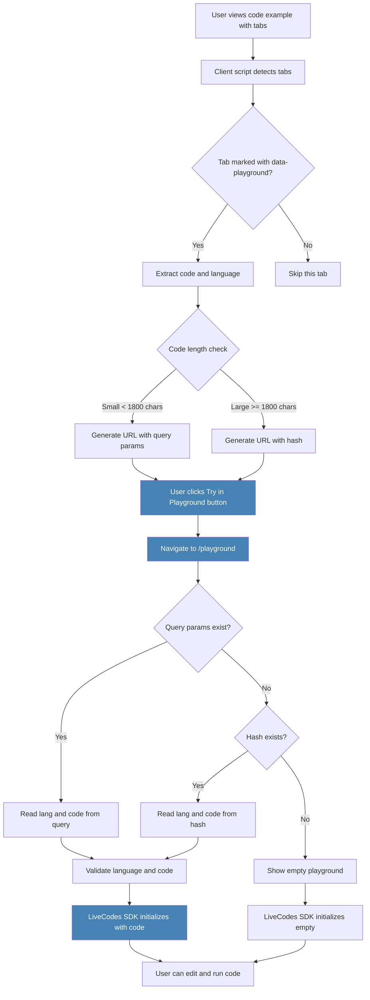

#

Add Interactive Playground to Pseudata Website

## Overview

Integrate [LiveCodes](https://github.com/live-codes/livecodes) playground at `/playground` path, enabling users to experiment with Pseudata code in TypeScript/JavaScript and Python directly in the browser without installation. Includes automatic "Try in Playground" buttons on marked code examples.

## Architecture

The playground will be a standalone Astro page that embeds LiveCodes using their SDK. Since Pseudata TypeScript SDK is available, we'll bundle it for use in the TypeScript playground. For other languages, we'll use LiveCodes' built-in language support.



## Implementation Steps

### 1. Install LiveCodes SDK

Add `livecodes` package to [`pseudata-website/package.json`](pseudata-website/package.json):

- Install via npm: `npm install livecodes`

- This provides the SDK for embedding playgrounds

### 1.5. Configure Script Injection for Tab Enhancement

Update [`pseudata-website/astro.config.mjs`](pseudata-website/astro.config.mjs) to inject the enhancement script:

- Add script to Starlight's `head.extra` configuration
- Script will be loaded on all documentation pages
- Use module type for ES6 support

**Implementation:**

```javascript
starlight({
  // ... existing config
  head: {
    extra: [
      // ... existing head items
      {
        tag: 'script',
        attrs: {
          src: '/scripts/enhance-tabs.js',
          type: 'module',
        },
      },
    ],
  },
})
```

**Alternative:** If head.extra doesn't work, create a custom layout component or use Astro's `<Script>` component in a shared component.

### 2. Create Playground Page

Create [`pseudata-website/src/pages/playground.astro`](pseudata-website/src/pages/playground.astro):

- Standalone Astro page (not part of Starlight content system)

- Import and initialize LiveCodes SDK

- Configure playground with **minimal UI**: editor frame and console frame only

- Configure display mode to show only essential components

- Style to match website's steel blue theme

**Minimal UI Configuration:**

```typescript
import { createPlayground } from 'livecodes';

// Get params (includes showLanguageSelector flag)
const { lang, code, showLanguageSelector } = getPlaygroundParams();

createPlayground('#playground-container', {
  config: {
    // Language and code (from URL params, or empty if not provided)
    script: {
      language: lang || 'typescript', // Use provided lang or default to typescript
      content: code || '', // Empty if no code provided
    },
  },
  view: 'editor', // Show editor view
  console: 'full', // Show full console for output
  // Show language selector if no language parameter provided
  showLanguageSelector: showLanguageSelector, // Show selector when lang is null
  // Hide unnecessary UI elements
  showEditor: true,
  showConsole: true,
  showCompiled: false, // Hide compiled code view
  showTests: false, // Hide test runner
  showTools: false, // Hide dev tools
  // Minimal toolbar (but keep language selector)
  toolbar: showLanguageSelector, // Show minimal toolbar with language selector if needed
  // Responsive layout
  layout: 'split', // Editor on left, console on right (or stacked on mobile)
});
```

**Language Selector Behavior:**

- **When lang parameter is present:** Hide language selector, use specified language
- **When no lang parameter:** Show language selector, allow user to choose
- **Supported languages in selector:** TypeScript/JavaScript, Python
- **Default language:** TypeScript (if no selection made)
- **Selector position:** Top of playground, above editor frame

**UI Components:**
- **Language Selector**: Visible when no language parameter provided (allows choosing TypeScript/JavaScript or Python)
- **Editor Frame**: Code editor with syntax highlighting
- **Console Frame**: Output console for execution results
- **Hide**: Compiled code view, test runner, dev tools (optional)
- **Toolbar**: Minimal toolbar (only when language selector is shown, or hidden if language is pre-selected)

**Display Modes:**
- Use `view: 'editor'` to focus on editor
- Use `console: 'full'` to show full console output
- Show language selector when navigating without language parameter
- Hide language selector when language is pre-selected via URL parameter
- Consider `layout: 'split'` for side-by-side editor/console on desktop
- Stack vertically on mobile for better UX

### 3. Prepare Code Templates

Create example templates for each language demonstrating Pseudata usage:

- **TypeScript**: Use actual Pseudata TypeScript SDK (bundle from `pseudata-poc/sdks/typescript`)

- **Python**: Example code (LiveCodes supports Python execution)

- **Go**: Example code (LiveCodes supports Go)

- **Java**: Example code (LiveCodes supports Java)

Each template should demonstrate:

- Creating a UserArray with seed 42
- Accessing user at index 1000

- Displaying user properties (name, email, etc.)

### 4. Bundle SDKs for Playground

**Language-Specific Strategy:**

**TypeScript/JavaScript: Bundle Locally (Recommended)**

- **Option A: Bundle to public directory (Recommended for TypeScript)**
  - Bundle TypeScript SDK from `pseudata-poc/sdks/typescript/src` to `pseudata-website/public/pseudata-sdk/`
  - Use esbuild/rollup to create a single bundle: `pseudata-sdk-typescript.js`
  - Serve from `/pseudata-sdk/typescript.js`
  - In playground, import via: `import { UserArray } from "/pseudata-sdk/typescript.js"`
  - **Pros:** Works offline, no external dependencies, full control, fast loading
  - **Cons:** Requires build step, larger bundle size (~50-100KB)

- **Option B: Import from npm/CDN (Alternative for TypeScript)**
  - If Pseudata TypeScript SDK is published to npm, use: `import { UserArray } from "pseudata"`
  - Or use CDN: `import { UserArray } from "https://cdn.jsdelivr.net/npm/pseudata@latest"`
  - **Pros:** Always up-to-date, no bundling needed
  - **Cons:** Requires npm publication, external dependency, network required

**Python: Use PyPI/CDN (When Published)**

- LiveCodes uses Pyodide (Python in WebAssembly) which can import packages from PyPI
- **For first implementation:** Keep installation code commented out until package is published
- **When Pseudata Python SDK is published to PyPI:**
  - Users can install in playground: `import micropip; await micropip.install('pseudata')`
  - Or use LiveCodes' package manager integration
  - **Pros:** Native Python execution, works with Pyodide ecosystem
  - **Cons:** Requires PyPI publication, package must be pure Python (no C extensions)
- **Initial implementation:** Show placeholder message or demo code until package is available

- **Alternative: Bundle Python files (Not Recommended)**
  - Python SDK files could be copied, but they'd need to be compatible with Pyodide
  - More complex than using PyPI

**Go: WebAssembly Compilation (Complex, Not Recommended for Initial Version)**

- Go code would need to be compiled to WebAssembly (WASM)
- Requires significant setup: `GOOS=js GOARCH=wasm go build`
- Pseudata Go SDK would need WASM-compatible dependencies
- **Pros:** Native Go execution in browser
  - **Cons:** Complex build process, larger bundle size, potential compatibility issues
- **Recommendation:** Skip Go SDK in initial playground version, or use server-side execution if LiveCodes supports it

**Java: Not Practical for Browser Playground**

- Java doesn't run natively in browsers
- Would require complex setup (Java applets deprecated, no modern solution)
- **Recommendation:** Skip Java SDK in playground, focus on TypeScript/Python

**Recommended Approach:**

1. **TypeScript: Bundle locally (Option A)** - Best user experience, works offline
2. **Python: Use PyPI if published (Option B)** - Native Python execution via Pyodide
3. **Go/Java: Skip in initial version** - Focus on languages that work well in browser

**Implementation for TypeScript:**

- Create build script in `package.json`: 
  ```json
  "build:sdk": "esbuild pseudata-poc/sdks/typescript/src/index.ts --bundle --format=esm --outfile=public/pseudata-sdk/typescript.js --external:none"
  ```

- Or use rollup/vite for more advanced bundling
- Update playground to import from local path: `import { UserArray } from "/pseudata-sdk/typescript.js"`
- **For first implementation:** Use local bundle (works immediately)
- **When published to npm:** Add commented alternative: `// import { UserArray } from "pseudata";`

**Implementation for Python (when published to PyPI):**

- **For first implementation (until package is published):** Keep installation code commented out
- In playground Python template, add installation step (commented for now):
  ```python
  # TODO: Uncomment when pseudata package is published to PyPI
  # import micropip
  # await micropip.install('pseudata')
  # from pseudata import UserArray
  
  # For now, use placeholder/demo code
  print("Python support coming soon - pseudata package will be available on PyPI")
  ```

- Or configure LiveCodes to auto-install the package (when available)

### 5. Styling Integration

Update [`pseudata-website/src/styles/custom.css`](pseudata-website/src/styles/custom.css):

- Add custom styles for playground container

- Ensure LiveCodes theme matches steel blue branding

- Style minimal UI components (editor and console frames)

- Make playground responsive and mobile-friendly

- Ensure editor and console frames are clearly visible and well-spaced

**Minimal UI Styling:**

```css
/* Playground container */
#playground-container {
  width: 100%;
  height: 600px; /* Or use viewport units for responsive */
  border: 1px solid var(--sl-color-accent);
  border-radius: 8px;
  overflow: hidden;
}

/* Ensure editor and console are visible */
#playground-container .editor-frame,
#playground-container .console-frame {
  background: var(--sl-color-background);
  color: var(--sl-color-text);
}

/* Mobile responsive */
@media (max-width: 768px) {
  #playground-container {
    height: 500px;
  }
}
```

### 6. Add "Try in Playground" Buttons to Tabbed Code Examples

**Implementation: Client-Side Enhancement**

- Create [`pseudata-website/src/scripts/enhance-tabs.ts`](pseudata-website/src/scripts/enhance-tabs.ts)
- Compile to JavaScript: `pseudata-website/public/scripts/enhance-tabs.js` (or use Astro's build process)
- Client-side script that runs after DOM content loads
- Finds all Starlight `<Tabs>` components that are:
  - Wrapped in a container with `data-playground` attribute, OR
  - Have `class="with-playground"` on the Tabs component itself
- Only processes tabs that are marked (opt-in approach)

**Detailed Code Extraction Logic:**

```typescript
function extractCodeFromTab(tabElement: HTMLElement): { code: string, lang: string } | null {
  // Find all code blocks in the tab (handle multiple blocks)
  const codeBlocks = tabElement.querySelectorAll('pre code');
  if (codeBlocks.length === 0) return null; // No code blocks found
  
  // Extract language from first code block's class
  const firstBlock = codeBlocks[0];
  const langMatch = firstBlock.className.match(/language-(\w+)/);
  if (!langMatch) return null; // No language detected
  
  // Map language identifiers (handle aliases)
  // Only TypeScript/JavaScript and Python are supported in playground
  const langMap: Record<string, string> = {
    'python': 'python',
    'py': 'python',
    'typescript': 'typescript',
    'ts': 'typescript',
    'javascript': 'typescript', // Map js to typescript
    'js': 'typescript',
  };
  
  const rawLang = langMatch[1].toLowerCase();
  const lang = langMap[rawLang];
  
  // Only process supported languages (TypeScript and Python only)
  // If language not in map or not supported, return null (no button)
  if (!lang) return null;
  
  const supportedLangs = ['python', 'typescript'];
  if (!supportedLangs.includes(lang)) return null;
  
  // Extract code content from all blocks (join with newlines)
  const codeParts = Array.from(codeBlocks).map(block => {
    // Use textContent to get plain text (removes HTML entities)
    return block.textContent || '';
  });
  
  const code = codeParts.join('\n\n').trim();
  if (!code) return null; // Empty code
  
  return { code, lang };
}
```

**Button Injection Logic:**

```typescript
function injectPlaygroundButton(codeBlock: HTMLElement, lang: string, code: string): void {
  // Check if button already exists (avoid duplicates)
  if (codeBlock.closest('pre')?.querySelector('.playground-button')) return;
  
  // Create button element
  const button = document.createElement('a');
  button.href = generatePlaygroundUrl(lang, code);
  button.className = 'playground-button';
  button.setAttribute('aria-label', `Try this ${lang} code in playground`);
  button.innerHTML = `
    <span>Try in Playground</span>
    <svg>...</svg> <!-- External link icon -->
  `;
  
  // Position button (top-right of code block container)
  const preElement = codeBlock.closest('pre');
  if (preElement) {
    preElement.style.position = 'relative';
    preElement.appendChild(button);
  }
}
```

**Language Mapping:**

- Support aliases: `ts` → `typescript`, `js` → `typescript`, `py` → `python`
- Case-insensitive matching
- **Only show buttons for supported languages:** `typescript`, `javascript`, `python`
- **Skip unsupported languages (Go, Java, etc.)** - no button shown, silently ignored

**Button Positioning:**

- Position: Absolute positioning in top-right corner of `<pre>` container
- Responsive: Adjust for mobile (move below code block on small screens)
- Avoid overlap: Check for line numbers or other UI elements
- Z-index: Ensure button appears above code block

**Selective Marking: Opt-In Approach**

- Only tabs with a marker get buttons
- Mark tabs by wrapping in a div with `data-playground` attribute:
  ```mdx
  <div data-playground>
    <Tabs>
      <TabItem label="Go">...</TabItem>
    </Tabs>
  </div>
  ```

- Or use a class on the Tabs component: `<Tabs class="with-playground">`
- Script only processes tabs inside marked containers or with the marker class
- **Benefits:** Full control over which examples get playground buttons, no accidental buttons on non-code tabs

**Button Styling:**

- Match steel blue theme (`#4682B4` for light, `#7CB3D9` for dark)
- Include icon (external link or play icon)
- Position: Top-right corner of code block or below it
- Hover effects consistent with website buttons

### 7. Update Playground Page to Accept URL Parameters

Modify [`pseudata-website/src/pages/playground.astro`](pseudata-website/src/pages/playground.astro):

- Read URL parameters using hybrid approach: query parameters (primary) → hash (fallback) → empty playground
- Pre-fill LiveCodes playground with the specified language and code
- Use LiveCodes SDK's `config` option to set initial code content
- Handle URL encoding/decoding of code snippets

**Hybrid URL Parameter Handling:**

**Primary: Query Parameters**

- First, check for `?lang=X&code=Y` in URL query string
- Works well for small code snippets (within URL length limits)

**Fallback: URL Hash**

- If no query parameters found, check URL hash: `#lang=typescript&code=...`
- Hash can handle longer code snippets (though still has browser limits)
- Parse hash as URLSearchParams

**Final Fallback: Empty Playground with Language Selector**

- If neither query params nor hash present, show empty playground with **language selector visible**
- Language selector allows users to choose between TypeScript/JavaScript and Python
- After language selection, show empty editor for that language

**Implementation in playground.astro:**

```typescript
function getPlaygroundParams(): { lang: string | null, code: string, showLanguageSelector: boolean } {
  // Primary: Try query parameters
  const urlParams = new URLSearchParams(window.location.search);
  let lang = urlParams.get('lang');
  let code = urlParams.get('code');
  
  // Fallback: Try hash if query params not found
  if (!lang && !code && window.location.hash) {
    const hashParams = new URLSearchParams(window.location.hash.substring(1));
    lang = hashParams.get('lang') || lang;
    code = hashParams.get('code') || code;
  }
  
  // Decode
  const decodedLang = lang ? decodeURIComponent(lang) : null;
  const decodedCode = code ? decodeURIComponent(code) : '';
  
  // Determine if language selector should be shown
  // Show selector if: no language parameter, or invalid language
  const showLanguageSelector = !decodedLang;
  
  // Validate language if provided (whitelist - only TypeScript and Python supported)
  let validLang: string | null = null;
  if (decodedLang) {
    const supportedLangs = ['python', 'typescript', 'javascript', 'js'];
    const normalizedLang = decodedLang.toLowerCase();
    validLang = supportedLangs.includes(normalizedLang) 
      ? (normalizedLang === 'js' ? 'typescript' : normalizedLang) // Map js to typescript
      : null; // Invalid language - show selector
  }
  
  return {
    lang: validLang, // null if not provided or invalid (triggers language selector)
    code: decodedCode,
    showLanguageSelector: showLanguageSelector || !validLang
  };
}

// Use in playground initialization
const { lang, code, showLanguageSelector } = getPlaygroundParams();
```

**URL Generation in enhance-tabs.ts:**

```typescript
function generatePlaygroundUrl(lang: string, code: string): string {
  const MAX_QUERY_LENGTH = 1800; // Leave room for base URL
  const encodedCode = encodeURIComponent(code);
  const encodedLang = encodeURIComponent(lang);
  
  // Try query parameters first (for small code)
  if (encodedCode.length <= MAX_QUERY_LENGTH) {
    return `/playground?lang=${encodedLang}&code=${encodedCode}`;
  } else {
    // Use hash for larger code snippets
    return `/playground#lang=${encodedLang}&code=${encodedCode}`;
  }
}
```

**URL Formats:**

```
/playground?lang=typescript&code=import%20%7B%20UserArray%20%7D%20from%20%22pseudata%22%3B...
/playground#lang=go&code=package%20main%20...
/playground (empty playground)
```

**Error Handling:**

- Validate language parameter (fallback to 'typescript' if invalid or unsupported)
- Handle missing code gracefully (show empty playground, not error)
- Handle malformed hash gracefully (try to parse, fallback to empty)
- Validate code content before passing to LiveCodes (empty string is valid)

### 8. Add Navigation Link

Update [`pseudata-website/astro.config.mjs`](pseudata-website/astro.config.mjs):

- Add playground link to Starlight sidebar or navigation
- Or add it to the homepage hero actions

### 10. Error Handling & Edge Cases

Create robust error handling for common scenarios:

**Code Extraction Failures:**

- If no code block found in tab: Skip button injection (don't show error)
- If language not detected: Skip button injection
- **If unsupported language (Go, Java, etc.): Skip button injection (silently)**
- **Only TypeScript/JavaScript and Python tabs will show "Try in Playground" buttons**

**URL Parameter Handling:**

- Invalid language: Fallback to 'typescript' with empty playground, show language selector
- Missing code: Show empty playground with language selector (not an error - user can start fresh)
- Missing language parameter: Show language selector, allow user to choose
- Malformed query params: Try to parse what's available, fallback to empty with language selector
- Malformed hash: Try to parse what's available, fallback to empty with language selector
- Neither params nor hash: Show empty playground with language selector (default state)

**LiveCodes Initialization:**

- Handle SDK load failures: Show fallback message
- Handle unsupported language in LiveCodes: Show error message
- Handle code execution errors: Let LiveCodes handle (it has built-in error display)

**User Experience:**

- Show loading state while playground initializes
- Handle slow network connections gracefully
- Provide fallback if JavaScript is disabled (show static code example)

**Implementation:**

```typescript
// In enhance-tabs.ts
try {
  const result = extractCodeFromTab(tab);
  if (result) {
    injectPlaygroundButton(codeBlock, result.lang, result.code);
  }
} catch (error) {
  console.warn('Failed to enhance tab:', error);
  // Fail silently - don't break page if enhancement fails
}
```

### 9. SEO and Metadata

Add proper meta tags and page title to playground page:

- Title: "Try Pseudata - Interactive Playground"

- Description: "Experiment with Pseudata's cross-language mock data generation"

- Open Graph tags for social sharing

- Canonical URL: `https://pseudata.dev/playground`

- Robots meta: Allow indexing (playground is useful content)

## Technical Considerations

**Language Support:**

- **TypeScript**: Full support via bundled Pseudata SDK (served from `/pseudata-sdk/typescript.js`)
  - Bundled locally for offline support and fast loading
  - Can fallback to npm/CDN if published

- **Python**: Support via PyPI when Pseudata Python SDK is published
  - LiveCodes uses Pyodide (Python in WebAssembly)
  - **For first implementation:** Installation code commented out, show placeholder message
  - **When published:** Can install via `micropip.install('pseudata')` in playground
  - Requires pure Python (no C extensions)

- **Go**: Not recommended for initial version
  - Would require WebAssembly compilation (complex)
  - Large bundle size, potential compatibility issues
  - Consider server-side execution if LiveCodes supports it

- **Java**: Not practical for browser playground
  - No native browser execution
  - Skip in initial version

**Performance:**

- LiveCodes is client-side, so no server load

- SDK is lightweight (~5kb gzipped)

- Lazy load playground on page load

- Minimal UI reduces rendering overhead

**Security:**

- LiveCodes runs in sandboxed iframes

- No server-side code execution needed

- Safe for user-generated code experimentation

## Files to Create/Modify

**New Files:**

- `pseudata-website/src/pages/playground.astro` - Main playground page with URL parameter support
- `pseudata-website/src/scripts/enhance-tabs.ts` - Client-side script to add buttons to marked tabs
- `pseudata-website/public/scripts/enhance-tabs.js` - Compiled JavaScript (or use build process)
- `pseudata-website/public/pseudata-sdk/` - Bundled TypeScript SDK files (if using local bundling)
- `pseudata-website/scripts/bundle-sdk.js` - Build script to bundle TypeScript SDK (if using local bundling)

**Modified Files:**

- `pseudata-website/package.json` - Add livecodes dependency, add build script for SDK bundling
- `pseudata-website/src/styles/custom.css` - Add playground styles and button styles
- `pseudata-website/astro.config.mjs` - Add script injection in head.extra, add navigation link (optional)
- Existing MDX files (optional) - Add `data-playground` wrapper or `class="with-playground"` to tabs that should have buttons

## Example Template Structure

Each language template will include:

**TypeScript:**

```typescript
// Using locally bundled SDK (until published to npm)
import { UserArray } from "/pseudata-sdk/typescript.js";
// TODO: When published to npm, uncomment and use:
// import { UserArray } from "pseudata";

const users = new UserArray(42);
const user = users.at(1000);
console.log(`Name: ${user.name}`);
console.log(`Email: ${user.email}`);
```

**Python:**

```python
# TODO: Uncomment when pseudata package is published to PyPI
# import micropip
# await micropip.install('pseudata')
# from pseudata import UserArray

# For first implementation (until package is published):
# Use placeholder/demo code or show message
print("Python support coming soon")
print("Once pseudata is published to PyPI, you can install it with:")
print("  import micropip")
print("  await micropip.install('pseudata')")
print("  from pseudata import UserArray")
print()
print("# Example of what it will look like:")
print("# users = UserArray(42)")
print("# user = users.at(1000)")
print("# print(f'Name: {user.name}')")
print("# print(f'Email: {user.email}')")
```

**Go:**

```go
package main

import (
    "fmt"
    "github.com/pseudata/pseudata"
)

func main() {
    users := pseudata.NewUserArray(42)
    user := users.At(1000)
    fmt.Printf("Name: %s\n", user.Name)
    fmt.Printf("Email: %s\n", user.Email)
}
```

**Java:**

```java
import dev.pseudata.UserArray;
import dev.pseudata.User;

public class Example {
    public static void main(String[] args) {
        UserArray users = new UserArray(42);
        User user = users.at(1000);
        System.out.println("Name: " + user.getName());
        System.out.println("Email: " + user.getEmail());
    }
}
```

**Note:** For Python/Go/Java, LiveCodes provides execution environments, but Pseudata SDKs may need to be available via import paths or bundled separately.

## Success Criteria

- Users can visit `/playground` and see interactive code editor
- **Language selector displays when no language parameter is provided** (allows choosing TypeScript/JavaScript or Python)
- **Minimal UI shows only editor frame and console frame** (no unnecessary UI elements, except language selector when needed)
- Users can use TypeScript/JavaScript and Python (Go/Java not supported in initial version)
- Code examples demonstrate Pseudata's cross-language consistency for supported languages
- Playground matches website branding
- Page is responsive and works on mobile
- Console displays execution output clearly
- **NEW:** "Try in Playground" buttons appear on marked tabbed code examples (opt-in)
- **NEW:** Buttons only appear for TypeScript/JavaScript and Python code blocks (Go/Java tabs are skipped)
- **NEW:** Clicking a button opens playground with the selected tab's language and code pre-filled
- **NEW:** URL parameters correctly encode/decode code snippets, with hash fallback for large code
- **NEW:** Buttons are visually consistent with website design (steel blue theme)
- **NEW:** Error handling gracefully handles edge cases (missing code, unsupported languages, etc.)
- **NEW:** Language mapping supports aliases (ts/js → typescript, py → python)
- **NEW:** Code extraction handles multiple code blocks in a single tab
- **NEW:** Button positioning avoids overlap with line numbers or other UI elements